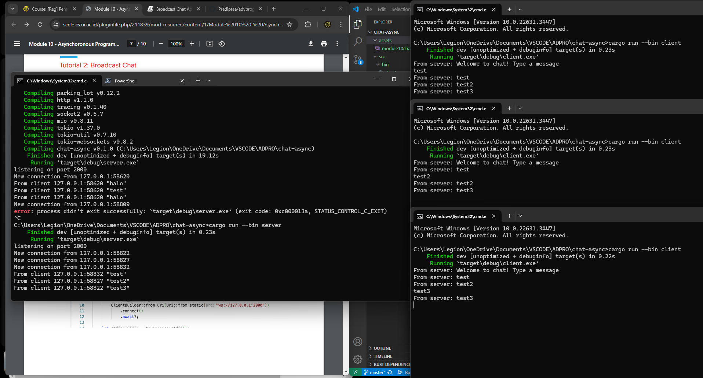

## Pradipta Arya P. - 2206083685
### Module 10 - Broadcast Chat

**2.1: Original Code and How it Run**

Setelah run server dan 3 clients, dapat dilihat bahwa setiap client dapat mengirim dan menerima pesan yang diterima oleh server. Setiap pesan yang diterima server dari client akan dikirimkan kembali kepada client yang menerimanya.

**2.2 Modifying Port**

Dapat dilihat dari gambar, dibutuhkan server dan client dengan port yang sama yaitu 8080 agar aplikasi berjalan normal.

**2.3 Small Changes, Add IP and Port**

Terdapat perubahan pada client.rs untuk memberikan identitas pada text. Kemudian menambah perubahan pada server.rs dengan mengubah bcast_tx, sehingga ketika bcast_tx mengirim pesan, juga akan memberikan identitas pengirim pada variabel {addr}